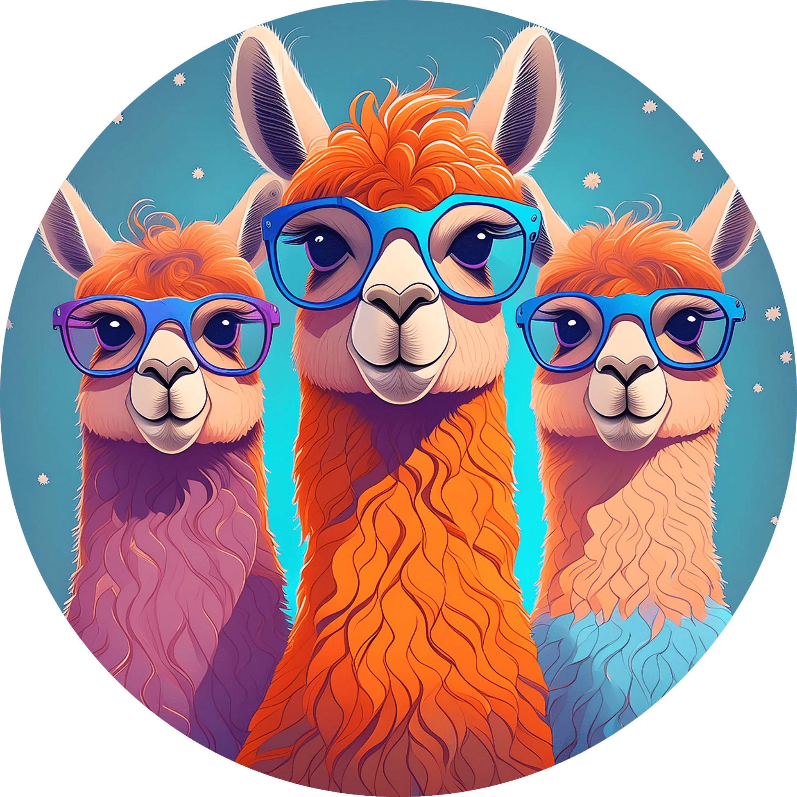

<div align="center">


# HawkLlama
[🤗**Huggingface**](https://huggingface.co/AIM-ZJU/HawkLlama_8b) | [🗂️**Github**](https://github.com/aim-uofa/VLModel)  | [📖**Technical Report**](assets/technical_report.pdf)

Zhejiang University, China

</div>


This is the official implementation of HawkLlama, an open-source multimodal large language model designed for real-world vision and language understanding applications. Our model features the following highlights.

1. HawkLlama-8B is constructed utilizing:
    - [Llama3-8B](https://huggingface.co/meta-llama/Meta-Llama-3-8B), the latest open-source large language model, trained on over 15 trillion tokens.
    - [SigLIP](https://huggingface.co/google/siglip-so400m-patch14-384), an enhancement over CLIP employing sigmoid loss, which achieves superior performance in image recognition.
    - An efficient vision-language connector, designed to capture high-resolution details without increasing the number of visual tokens, helps reduce the training overhead associated with high-resolution images.

2. For model training, we utilize [Llava-Pretrain](https://huggingface.co/datasets/liuhaotian/LLaVA-Pretrain) dataset for pretraining and a mixed dataset specifically curated for instruction tuning, which contains both multimodal and language-only data for supervised fine-tuning. 

3. HawkLlama-8B is developed on [NeMo](https://github.com/NVIDIA/NeMo.git) framework, which facilitates 3D parallelism and offers scalability potential for future extension.

Our model is open-source and reproducable. Please check our [technical report](assets/technical_report.pdf) for more details. 


<!-- ## News

[04/30] Llama3-LaMMly-8B is released, trained on a larger dataset, supporting higher resolution images, and also supporting Llama3 as the backbone. For LaMMly, we constructed a multimodal dataset containing 2.6M SFT sample, ensuring that LaMMly can achieve better generalization and improved image understanding. For more details, please refer to our [blog] and [technical report]. -->

## Contents
- [Setup](#setup)
- [Model Weights](#model-weights)
- [Inference](#inference)
- [Evaluation](#evaluation)
- [Demo](#demo)


## Setup

1. Create envoirment and activate it.
```Shell
conda create -n hawkllama python=3.10 -y
conda activate hawkllama
```

2. Clone and install this repo.
```
git clone https://github.com/aim-uofa/VLModel.git
cd VLModel
pip install -e .
pip install -e third_party/VLMEvalKit
```

## Model Weights

Please refer to our [HuggingFace repository](https://huggingface.co/AIM-ZJU/HawkLlama_8b) to download the pretrained model weights.

## Inference

We provide an example code for inference.

```Python
import torch
from PIL import Image
from HawkLlama.model import LlavaNextProcessor, LlavaNextForConditionalGeneration
from HawkLlama.utils.conversation import conv_llava_llama_3, DEFAULT_IMAGE_TOKEN

processor = LlavaNextProcessor.from_pretrained("AIM-ZJU/HawkLlama_8b")

model = LlavaNextForConditionalGeneration.from_pretrained("AIM-ZJU/HawkLlama_8b", torch_dtype=torch.bfloat16, low_cpu_mem_usage=True) 
model.to("cuda:0")

image_file = "assets/coin.png"
image = Image.open(image_file).convert('RGB')

prompt = "what coin is that?"
prompt = DEFAULT_IMAGE_TOKEN + "\n" + prompt

conversation = conv_llava_llama_3.copy()
user_role_ind = 0
bot_role_ind = 1
conversation.append_message(conversation.roles[user_role_ind], prompt)
conversation.append_message(conversation.roles[bot_role_ind], "")
prompt = conversation.get_prompt()
inputs = processor(prompt, image, return_tensors="pt").to("cuda:0")
inputs['pixel_values'] = inputs['pixel_values'].to(torch.bfloat16)
output = model.generate(**inputs, eos_token_id=processor.tokenizer.eos_token_id, max_new_tokens=2048, do_sample=False, use_cache=True)

print(processor.decode(output[0], skip_special_tokens=True))
```

## Evaluation

Evaluate is modified based on the VLMEval codebase.

``` bash
# single gpu
python third_party/VLMEvalKit/run.py --data MMBench_DEV_EN MMMU_DEV_VAL SEEDBench_IMG --model hawkllama_llama3_vlm --verbose
# multi-gpus
torchrun --nproc-per-node=8 third_party/VLMEvalKit/run.py --data MMBench_DEV_EN MMMU_DEV_VAL SEEDBench_IMG --model hawkllama_llama3_vlm --verbose
```

The results are shown below:

| Benchmark       | Our MethodName | LLaVA-Llama3-v1.1 | LLaVA-Next |
|-----------------|----------------|-------------------|------------|
| MMMU val        | **37.8**       | 36.8              | 36.9       |
| SEEDBench img   | **71.0**       | 70.1              | 70.0       |
| MMBench-EN dev  | **70.6**       | 70.4              | 68.0       |
| MMBench-CN dev  | **64.4**       | 64.2              | 60.6       |
| CCBench         | **33.9**       | 31.6              | 24.7       |
| AI2D test       | 65.6           | **70.0**          | 67.1       |
| ScienceQA test  | **76.1**       | 72.9              | 70.4       |
| HallusionBench  | 41.0           | **47.7**          | 35.2       |
| MMStar          | 43.0           | **45.1**          | 38.1       |

## Demo

Welcome to try our [demo](http://115.236.57.99:30020/)!


## Acknowledgements

We express our appreciation to the following projects for their outstanding contributions in academia and code development: [LLaVA](https://github.com/haotian-liu/LLaVA), [NeMo](https://github.com/NVIDIA/NeMo), [VLMEvalKit](https://github.com/open-compass/VLMEvalKit) and [xtuner](https://github.com/InternLM/xtuner).

## License

HawkLlama is released under the [Apache 2.0](https://github.com/Lightning-AI/lightning-llama/blob/main/LICENSE) license.